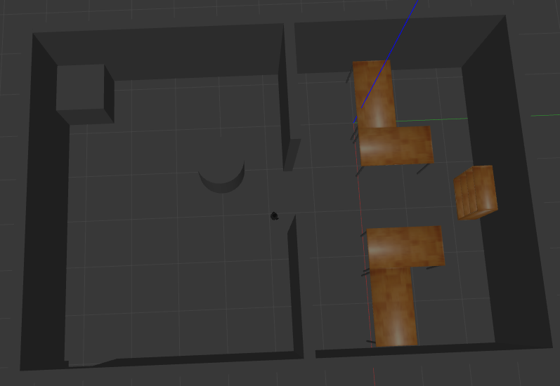
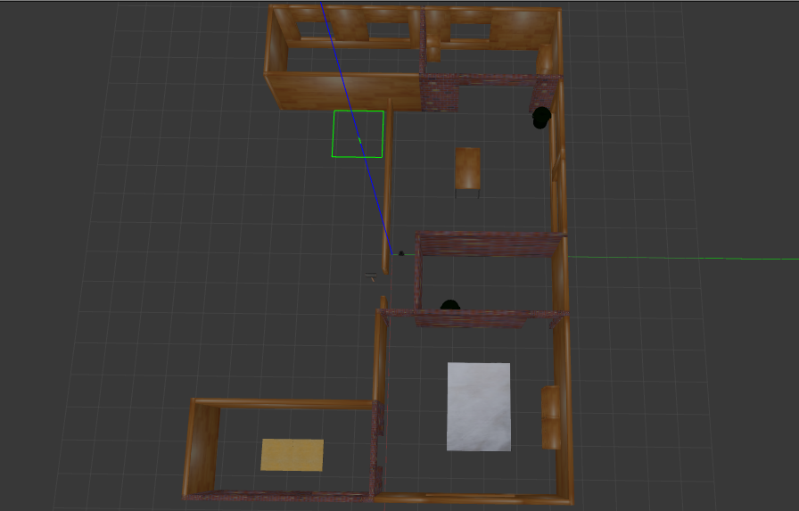
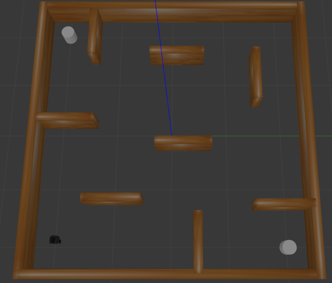

# robotics_challenge
Robotic challenge scenarios for the Robotics and Advanced subject of UPO's Software Engineering Grade

## Installation instructions

This branch has been specifically adapted to the ROS Melodic and Noetic distributions. It has been tested in Ubuntu 18.04 and Ubuntu 20.04, respectively.

We provide you with a useful installation script that you can use for easily installing it into a ROS workspace. To use it you have to specify the target catkin workspace where the node should be installed. To do this you can use:

```
rosrun robotics_challenge install.bash
```

## How to run the challenge

The goal of the challenge is to setup the simulation environment in which your path tracking, path planning and collision avoidance modules should be used in order to guide the Turtlebot robot to a goal destination.

This configuration includes the setup of:

* A gazebo world file that has the environment where the robot is placed on.
* The spawn of a Turtlebot robot equipped with a LASER sensor and a RGBD camera.
* The localization module (AMCL) and the map that should be used as the frame to determine the navigation goals.

A convenient bash script is available for each scenario (1-4). To run each scenario just replace the scenario number. 

Example:

```
$  rosrun robotics_challenge robotics_challenge_1.bash
```

## Scenarios
The challenge has four scenarios:

### Scenario 1 and 2
The first version are two rooms conected by a door. The second one is the same rooms with an obstacle in the middle.



### Scenario 3
A house with multiple rooms


### Scenario 4
A maze-like room


## The code
In this solution we have multiples nodes:
* ControlGoal
* CollisionAvoidance
* dijkstra & planner node

And we alse have a launcher to run them all, the robotics_challenge.launch

Let's take a closer look at each one:

### ControlGoal
ControlGoal is the node that will output the speed and the node that will choose the next goal to reach. It will receive the Path from the suscriber.
In controlGoal we have a few input parameters, those are:
* max_linear_speed
* max_angular_speed.

Both of them to control the maximum value of each one.

There are also a few functions:

#### speedControl
The function that will receive a goal and modify the linear and angular speed to reach it

```python
def speedControl(self, base_goal):
    linear = math.sqrt(math.pow(base_goal.point.x,2) + math.pow(base_goal.point.y, 2))
    angular = math.atan2(base_goal.point.y, base_goal.point.x)
    if (linear > self.max_linear_speed):
        linear = self.max_linear_speed
    if(angular > self.max_angular_speed):
        angular = self.max_angular_speed
    self.publish(linear, angular)
```

#### pathControl
This function iterate over all the path points searching for the closest to the robot. After finding it, it iterate from the closest point to the last one until reach the last one or until find a point at a given minimun distance.

If there is no point at the minimun given distance then it keeps the last point as goal

You can take a look to the code [Here](./scripts/controlGoal.py)

### CollisionAvoidance

This node receive the information from the laser scan. It react against close obstacles modifying the direction of the robot with a repulsive force.

The main function is the potential_control, it takes all the obstacles from the laserscan and apply a repulsive force against those who are closer than a minimun distance
```python
    def potential_control(self):

        if self.cmd_vel_data is not None:
            found=False
            xSpeed, ySpeed = self.angularToCartesian(self.cmd_vel_data.linear.x,self.cmd_vel_data.angular.z)

            linear=self.cmd_vel_data.linear.x
            angular=self.cmd_vel_data.angular.z

            for i in range(0, len(self.obstacles)):
                dist = np.power(self.obstacles[i].x, 2) + np.power(self.obstacles[i].y,2)
                if(dist < self.min_distance):
                    found=True
                    xSpeed = xSpeed - (self.mass*(self.obstacles[i].x / dist))
                    ySpeed = ySpeed - (self.mass*(self.obstacles[i].y / dist))

            if found:
                linear, angular= self.cartesianToAngular(xSpeed,ySpeed)
                if linear > self.max_linear_speed:
                    linear = self.max_linear_speed
                if angular > self.max_angular_speed:
                    angular = self.max_angular_speed

            self.publish(linear,angular)
```
You can take a look to the file [Here](./scripts/collisionAvoidance.py)


### Dijkstra & planner
Planner node will receive a goal and a map, it will call Dijkstra to get the route and publish the route to the publisher.

It also allow selecting new goals after every execution or while executing.
